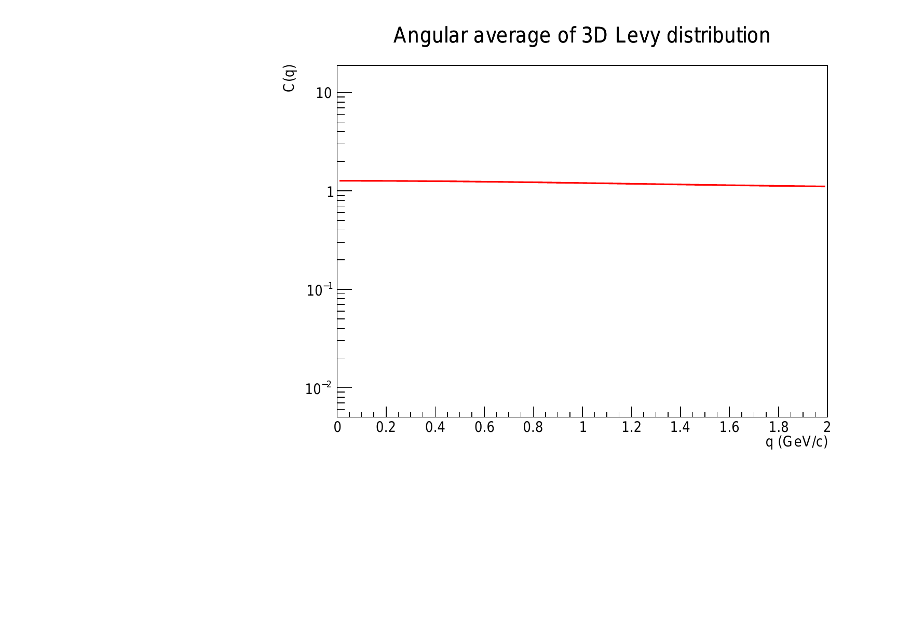
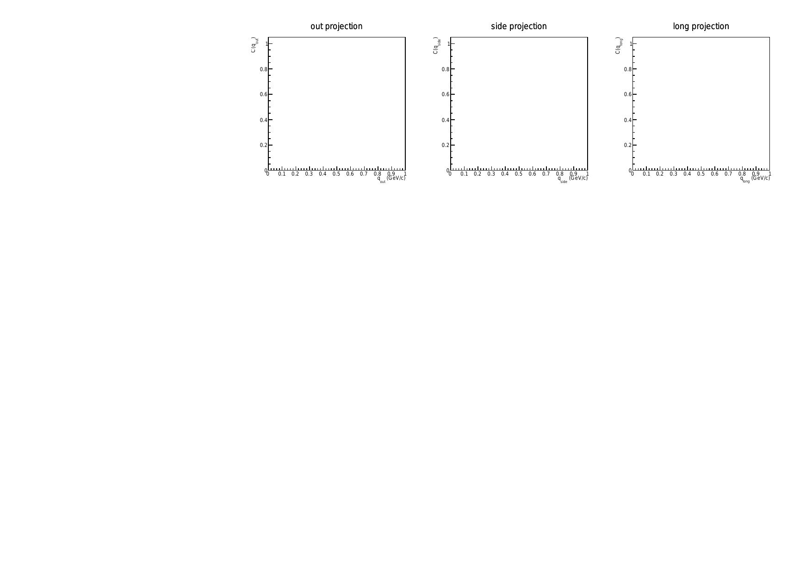

# Lévy source fit
Code for calculating angular average and projections of a full 3D Lévy-stable distribution and fit it to data (usually obtained from a simulation). This was used for example in https://www.nature.com/articles/s42005-025-01973-x

## Description
This package contains a calculations of the above-mentioned angular average and projections, as well as fitting and plotting codes.

## Dependencies
The code requires the following dependencies to be installed:
- [**ROOT**](https://root.cern/): A data analysis framework. `Minuit2` is also required for fitting.
- [**poppler-utils**](https://poppler.freedesktop.org/): A PDF rendering library. The `pdftoppm` utility is used to convert the generated PDF plots to PNG format. On Debian-based systems, it can be installed with `sudo apt-get install poppler-utils`.
- **Binary data table**: The calculations require a binary table of pre-calculated values. This can be downloaded from https://csanad.web.elte.hu/phys/levy_proj3D_values.dat.

## File content

### Basics
- [**README.md**](README.md): This README file
- [**Makefile**](Makefile): Using `make all`, it will create all executables (which will have the suffix `.exe`), and requires the existence of a `deps` directory (to store the dependencies)

### Libraries
- [**Levy_proj_reader.cpp**](Levy_proj_reader.cpp): The main calculator class, containing the reader and evaluator (including interpolation) of the binary table
- [**Levy_proj_reader.h**](Levy_proj_reader.h): Header file for the `Levy_proj_reader` class
- [**levy_1Davg_fit.cc**](levy_1Davg_fit.cc): Reading the angular average and fitting it to some simulated data.
- [**levy_proj3D_fit.cc**](levy_proj3D_fit.cc): Reading the 3 projections (out, side, long) and fitting them simultaneously to some simulated data.
- [**create_example_plots.cc**](create_example_plots.cc): Creating example plots for the angular average and the projections
- [**my_includes.h**](my_includes.h): A long and general list of includes, can be substituted as the user wishes

## Example plots
The code can also be used to create example plots. The executable `create_example_plots.exe` is created with `make create_example_plots.exe`. It can be run as `./create_example_plots.exe` (after downloading the binary table mentioned above). This will create two PNG files, `levy_1Davg_example.png` and `levy_proj3D_example.png`.

Below are example plots of the 1D angular average of the 3D Lévy distribution and the 1D projections of the 3D Lévy distribution.

### 1D angular average of the 3D distribution

### 1D projections of the 3D distribution

